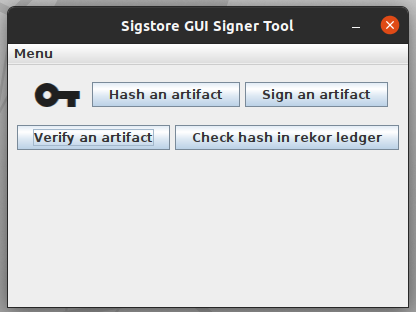

# Sigstore GUI signer tool
This is a Java Swing frontend client to sigstore infraestructure


It should work on any x86_64 bit computer with Java runtime enviroment. It has been tested with Ubuntu 20.04 LTS with OpenJDK 21.

## Build from source
To build from source use maven and the pom.xml provided in Netbeans or any other Java IDE.

## Binary distribution
A jar file is provided into the releases section so to run the program simply download the jaf file and run it on the terminal with:
```
java -jar <downloaded.jar>
```
Or make it executable and double-click on it.

In Linux you can just:
```
sudo chmod 755 <downloaded.jaf>
```
# Usage
The usage of the program should be almost trivial if you have at least read some of the sigstore official documentation.

1. The first button "Hash an artifact" will execute a 256 bit hash on the selected file and paste it to the screen
2. Sign an artifact will use sign the selected file and produce a 'bundle' that matches  this signed file. To check the validity
   of the file you will need to have this bundle.
3. Verifies the selected file with his correspondant bundle.
4. If you signed a file you can just check with his hash against rekor public ledger without the need of a bundle. This is convenient
   if you do not want to manage bundles.


